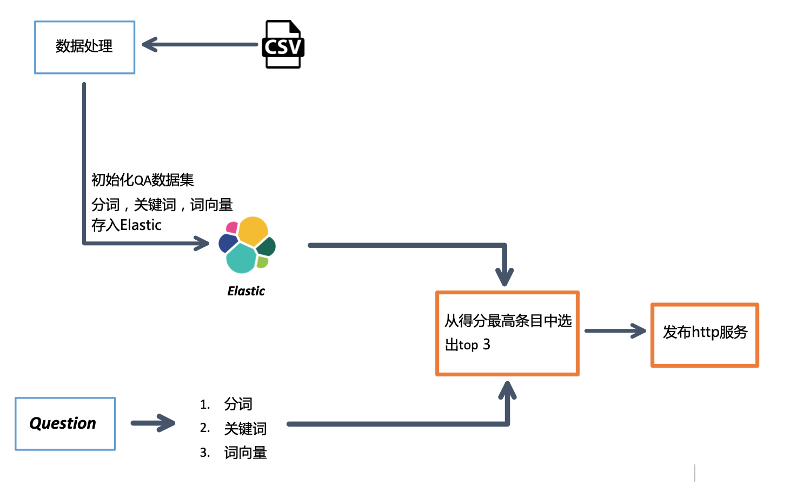
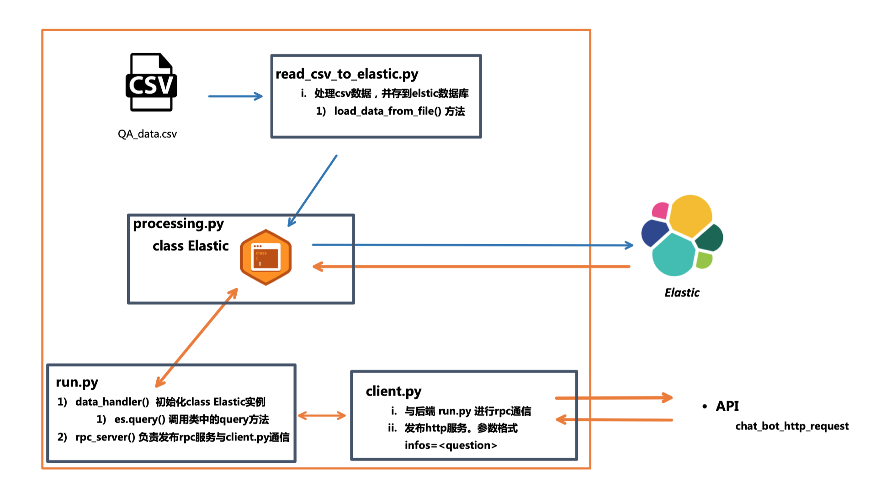
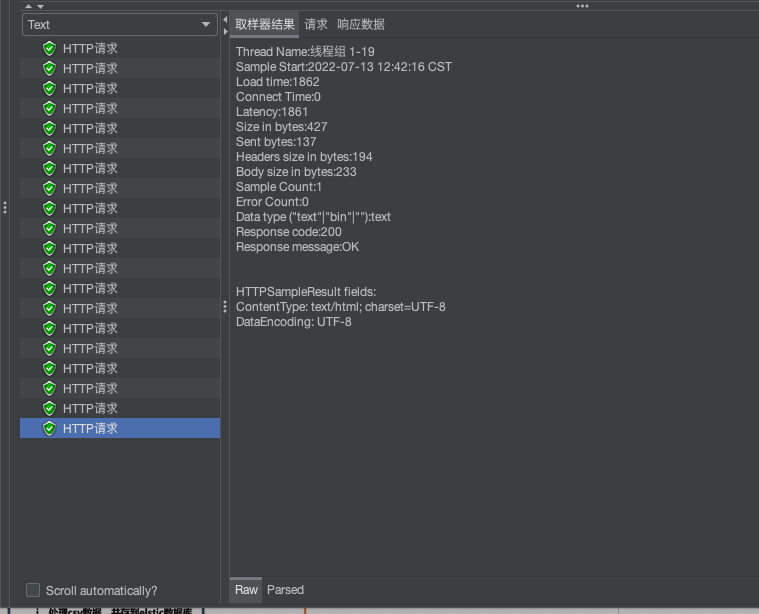

---

### Quick Guide

#### 需要提前准备好的服务
* Elastic
* Clip-Service

~~~
$ clip-service是一个将句子转化为句向量的开源工具
$ github地址：https://github.com/jina-ai/clip-as-service
$ 执行下面命令安装clipserver
pip install clip-server
python -m clip_server
~~~

---

#### 代码部署
~~~
$ 安装依赖环境requirements
$ 运行 read_csv_to_elastic.py, 结构化原始QA存到elastic

$ 运行 ./service/run.py 启动后端服务
$ 运行 ./service/client.py 发布http服务
~~~
~~~
$ run.py和client.py间通讯使用grpc，因此service文件夹中 grpc开头的文件 不需要改动
$ run.py不能直接发布http server，会与clip_Client冲突，报runtime error错误

QA_bot
├─README.md
├─requirements.txt
├─utils
|   └─path.py
├─service
|    ├─client.py
|    ├─grpc.proto
|    ├─grpc_pb2.py
|    ├─grpc_pb2_grpc.py
|    ├─processing.py
|    ├─read_csv_to_elastic.py
|    └─run.py      
├─model
|   └──uncased_L-12_H-768_A-12
├─data
|  ├─qa.csv
|  └stop_words.txt
└─dao
   ├─bot_log.txt
   └query_resp.json
~~~

---

#### 本地化数据
* 为了测试方便，run.py每处理一次请求，就把返回的内容本地化到./dao/query_resp.json
* 外部与http接口的数据交互，本地化在./dao/bot_log.txt

---
#### 模型细节
* 将csv中的问题逐行读取，得到分词，关键词，句向量，将三种数据按照Mapping结构存到elastic
* 传进来的query也使用相同的处理步骤得到三种特征变量，按照keywords去elastic中检索，再使用分词&句向量与query进行比较，计算相似度分数，返回得分最高的三个条目。
* processing.py:184行，有去重的操作，因此返回条目可能小于设定数目。

---
### pipeline

### 代码结构

### api测试

* 线程池开了8个，20个请求延迟1861ms，返回内容无错误

